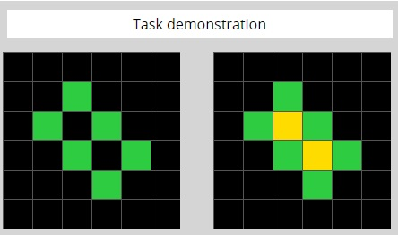
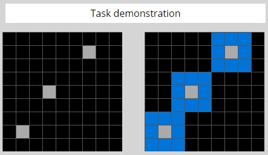

# ARC DSL

Implements a domain specific language for the ARC challenge by François Chollet.

Programs in ARC DSL look like this:

`paint({ part: "interior"}, "yellow");`

and this:

`crop({ "contains-most-squares-of-color": "$least-used-color" });`

## How to run

Use `node index.js` to run a program on a task file (you can set the program to run & task to run it on in the file itself).

Use `test.js` to test all program/task pairs in `/handled-tasks`.

## Other scripts

`executor.js` contains the logic that applies an ARC DSL program to a grid. In a sense it is the "main" script that does most of the work.

`grid-to-canvas.js` writes a grid to an html file for easier viewing. `index.js` uses it to output the result of running a program on a task.

`/helpers` contains scripts that help handling 2D grids, for things such as determining the "interior" of selected objects.

## How it works

ARC DSL is composed of javascript functions. To make it possible for an AI to write these programs, the language has been made as simple as possible - there is no boilerplate nor any auxiliary arguments being passed around.
This however requires that an ARC DSL program be run by calling another script (which is what `index.js` or `test.js` are for).

The different functions, also known as ARC DSL commands, receive varying parameters - you can look at `executor.js` to look at the logic of the functions themselves.

When you see an object being passed to one of these commands, that's a `selector` object: an empty `selector` targets all objects in the grid. As you add parameters to it, you filter the selection. You can target only green objects, or only the interior of the objects.

An "object" is a group of connected squares of non background color. The background color is black (0) by default, but it should be customizable (this functionality is not yet implemented).

The following commands are implemented:

* `paint`: Changes the color of selected objects into a given color.
* `crop`: Crops the grid to encompass only the selected objects.
* `outline`: Draws a 1-square-wide outline around the selected objects.
* `scaleGrid`: Scales the grid up or down by a given factor, preserving its contents.

I also started implementing special tokens (strings starting with the character "$") that act as placeholders for dynamic values. These strings can be passed to commands either as parameters or as part of the selector object (the object that specifies which objects in the grid to target). For example:

* `$least-used-color` would be translated into the color used by the least squares in the input grid (useful when one wants to specify the color being used to "highlight").
* `$numberOfNonBackgroundSquaresInGrid` would be the number of squares in the grid of non background color.

Other commands and placeholder tokens are possible, but these are the only I have implemented so far.

## Examples

You can see examples of solved tasks in `/handled-tasks`. For example, the task `00d62c1b`:



Can be solved with the following program:

`paint({ part: "interior"}, "yellow");`

And task `4258a5f9`:



Can be solved with:

`outline({}, "blue");`

## Notebook

The notebook in `ARC.ipynb` is an earlier attempt at the ARC challenge - it does not use the domain specific language at all and is unrelated to the rest of the repo.

## License

```
This is free and unencumbered software released into the public domain.

Anyone is free to copy, modify, publish, use, compile, sell, or
distribute this software, either in source code form or as a compiled
binary, for any purpose, commercial or non-commercial, and by any
means.

In jurisdictions that recognize copyright laws, the author or authors
of this software dedicate any and all copyright interest in the
software to the public domain. We make this dedication for the benefit
of the public at large and to the detriment of our heirs and
successors. We intend this dedication to be an overt act of
relinquishment in perpetuity of all present and future rights to this
software under copyright law.

THE SOFTWARE IS PROVIDED "AS IS", WITHOUT WARRANTY OF ANY KIND,
EXPRESS OR IMPLIED, INCLUDING BUT NOT LIMITED TO THE WARRANTIES OF
MERCHANTABILITY, FITNESS FOR A PARTICULAR PURPOSE AND NONINFRINGEMENT.
IN NO EVENT SHALL THE AUTHORS BE LIABLE FOR ANY CLAIM, DAMAGES OR
OTHER LIABILITY, WHETHER IN AN ACTION OF CONTRACT, TORT OR OTHERWISE,
ARISING FROM, OUT OF OR IN CONNECTION WITH THE SOFTWARE OR THE USE OR
OTHER DEALINGS IN THE SOFTWARE.

For more information, please refer to <https://unlicense.org>
```
